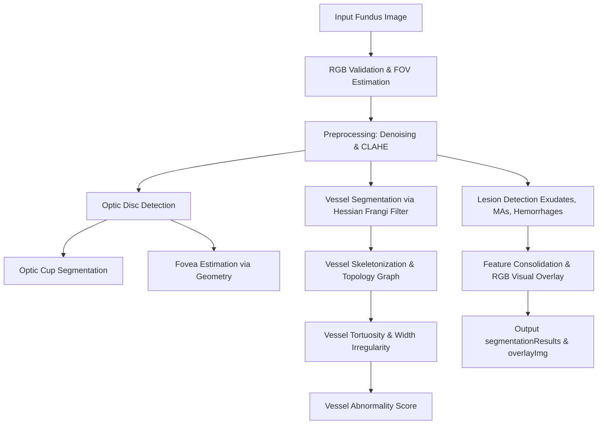

# RetinaScan — Module 3: Retinal & Lesion Segmentation
## Explainable AI for Diabetic Retinopathy Screening in Rural India
### Smart India Hackathon 2026 — Problem Statement SIH260038

RetinaScan is the Retinal Structure Segmentation and Vessel Abnormality Analysis module developed as part of the Explainable AI (XAI) Diabetic Retinopathy Screening System. It is implemented entirely in MATLAB, utilizing classical computer-vision algorithms to provide an explainable baseline.

---

## 1. Module Purpose & Objectives
The primary purpose of Module 3 is to process an enhanced retinal fundus image and identify:
1. **Anatomical Structures**: Retinal blood vessels, optic disc, optic cup, and estimated fovea center.
2. **Pathological Lesion Candidates**: Hard/soft exudates, microaneurysms, and hemorrhages.
3. **Vascular Biomarkers**: Vascular density, branching points, vessel segment tortuosity, and local vessel widths.
4. **Vessel Abnormality Indicator**: A non-clinically validated quantitative score representing the overall irregularity of the retinal vasculature.

---

## 2. Input & Output Contract API

### Main Interface Signature:
```matlab
[segmentationResults, overlayImg] = segment_retina(enhancedImg, options)
```

### Input Parameters:
- `enhancedImg` (`uint8` matrix): RGB fundus image (typically $H \times W \times 3$), grayscale image, or normalized double image.
- `options` (`struct`): Optional parameters including:
  - `.vesselSensitivity`: Threshold sensitivity factor between 0.0 and 1.0 (default: `0.5`).
  - `.enableLesions`: Logical flag to enable lesion detection (default: `true`).
  - `.roiMask`: Logical Field-of-View (FOV) mask. If missing, estimated automatically.

### Output Structure:
`segmentationResults` is a MATLAB `struct` containing:
- `.vesselMask`: Logical mask of segmented blood vessels.
- `.vesselSkeleton`: Logical mask of skeletonized blood vessels.
- `.opticDiscMask`: Logical mask of the optic disc.
- `.opticCupMask`: Logical mask of the optic cup.
- `.foveaMask`: Logical mask of the estimated fovea region.
- `.fovea`: Centroid coordinates `[x, y]` and detection `.confidence`.
- `.exudateMask`: Logical mask of hard/soft exudate candidates.
- `.microaneurysmMask`: Logical mask of microaneurysm candidates.
- `.hemorrhageMask`: Logical mask of hemorrhage candidates.
- `.lesionCombinedMask`: Combined logical mask of all three lesions.
- `.features`: Struct of computed quantitative values (e.g. area, count, ratio, density, tortuosity).
- `.vesselAnalysis`: Struct containing segments list, segment tortuosity, and abnormality scores.
- `.confidence`: Pipeline confidence scores.
- `.explanations`: Text explanations detailing the computer-vision reasoning for each output.

`overlayImg` is an RGB `uint8` image showing composite visual overlays.

---

## 3. Pipeline & Algorithms Methodology



### A. Blood Vessel Segmentation & Skeletonization
- **Vessel Enhancement**: multi-scale 2D Hessian matrix analysis (Frangi filter) at scale $\sigma \in \{1.0, 1.5, 2.5\}$. Smooth derivatives are computed to calculate eigenvalues $\lambda_1, \lambda_2$ ($|\lambda_1| \le |\lambda_2|$). Tubular vessel-like structures yield high values where $\lambda_2 > 0$ on green channel background-corrected images.
- **Binarization**: Adaptive thresholding utilizing local neighborhood mean values and sensitivity parameters.
- **Skeletonization**: Morphological thinning (`bwskel` or `bwmorph` skel) to extract centerlines.

### B. Optic Disc & Cup Segmentation
- **Localization**: Connected components are extracted on the brightest regions of the red/green channels and ranked based on a multi-cue score: `Score = Brightness * Solidity * LocationPenalty * (1 - Eccentricity)`. If components fail, a fallback Circular Hough Transform is executed via `imfindcircles`.
- **Active Contour Refinement**: Local threshold binarization is executed within a circular ROI centered on the candidate coordinates.
- **Cup Segmentation**: The brightest central region within the optic disc is thresholded (`mean + 0.3 * std`) inside an eroded disc boundary to estimate Cup-to-Disc Ratio (CDR): $\text{CDR} = \sqrt{\text{CupArea} / \text{DiscArea}}$.

### C. Fovea Estimation
- **Geometrical Estimate**: Located temporally from the optic disc at approximately 2.5 disc diameters (5 disc radii) away, and 0.2 disc radii vertically downward. The search direction is derived from the horizontal position of the optic disc (Right Eye OD vs Left Eye OS).
- **Refinement**: Darkest avascular pixel search within a $1.0 \times \text{discRadius}$ local neighborhood on the green channel.

### D. Lesion Candidate Detection
- **Optic Disc Margin Exclusion**: The optic disc region is expanded and masked out to avoid false detections.
- **Vessel Mask Exclusion**: Segmented blood vessels are dilated and masked out for dark lesion segmentation.
- **Exudates**: Morphological top-hat filtering (`strel('disk', 12)`) and thresholding (`mean + 2.5 * std`) on the green/red channel.
- **Microaneurysms**: Bottom-hat morphological filtering (`strel('disk', 5)`) and multi-scale Laplacian of Gaussian (LoG) blob detection at scales $\sigma \in \{1.0, 1.5, 2.0\}$. Small dark blobs with circularity ($Eccentricity < 0.85$) and size ($\le 25$ pixels) are selected.
- **Hemorrhages**: Bottom-hat filtering (`strel('disk', 15)`) followed by size thresholding ($25 < Area \le 1500$) and shape filters.

---

## 4. Vessel Abnormality Score (Individual Differentiator)
The Vessel Abnormality Score is a quantitative, research-oriented metric calculated from physical vascular properties. It combines three sub-scores:
1. **Tortuosity Score ($S_T$)**: Measures segment curvature ($\text{arcLength} / \text{endpointDistance}$) and the ratio of highly curved segments.
2. **Branching Score ($S_B$)**: Measures the density of branch points per unit retina area.
3. **Width Irregularity Score ($S_W$)**: Derived from the coefficient of variation (CV) of local vessel diameters estimated using 2D distance transforms (`bwdist`).

$$\text{Vessel Abnormality Score} = 0.50 \cdot S_T + 0.25 \cdot S_B + 0.25 \cdot S_W$$

% These weights are prototype research heuristics and are NOT clinically validated.

### Interpretation:
- **0–30**: Lower vessel irregularity detected.
- **31–60**: Moderate vessel irregularity detected.
- **61–100**: Higher vessel irregularity detected.

---

## 5. Explainable Visualization Legend
The composite `overlayImg` uses the following color-coding:
- **GREEN**: Segmented blood vessels (normal mode)
- **BLUE Outline**: Optic disc boundary
- **PURPLE Circle**: Estimated fovea location
- **YELLOW**: Exudate candidates
- **ORANGE Dots**: Microaneurysm candidates
- **RED**: Hemorrhage candidates
- **Vessel Tortuosity Overlay Mode**:
  - **GREEN**: Lower tortuosity ($\le 1.10$)
  - **ORANGE**: Moderate tortuosity ($1.10 < \text{tortuosity} \le 1.25$)
  - **RED**: Higher tortuosity ($> 1.25$)

---

## 6. Integration With Other Modules
- **Module 2 (Enhancement)**: Feeds RGB contrast-enhanced images directly to `segment_retina.m`.
- **Module 4 (DR Grading)**: Consumes the segmentation feature struct (e.g. lesion areas, counts, CDR, and vessel density) to grade Diabetic Retinopathy severity.
- **Module 5 (Explainability)**: Integrates the logical masks and text `.explanations` to generate Grad-CAM or attribution heatmaps.
- **Module 6 (Simulink)**: Wraps `segment_retina.m` inside a MATLAB Function block with fixed-size signal interfaces.

---

## 7. MATLAB Toolbox Requirements
- MATLAB (R2018a or later recommended)
- **Image Processing Toolbox**
- **Computer Vision Toolbox**
- **Signal Processing Toolbox**

---

## 8. Execution Instructions

### Run UI Dashboard (Interactive Interface):
Open MATLAB and launch the interactive dark-themed app dashboard:
```matlab
retina_segmentation_app
```
This launches a standalone graphical interface where you can dynamically load fundus images, tune vessel sensitivity, execute segmentations, toggle visualization modes (segmentation overlay, vessel tortuosity, lesion maps), and view detailed metric reports and algorithmic explanations.

### Run Script Demo:
Open MATLAB and execute:
```matlab
run_module3_demo
```
This script runs the entire segmentation pipeline, prints quantitative features and abnormality scores, and displays multi-pane visual outputs. If no real fundus images are present in `demo_samples/`, a realistic synthetic fundus image is automatically generated.

### Run Tests:
Run the unit test runner in MATLAB:
```matlab
addpath(pwd);
results = test_module3();
```

---

## 9. Medical Disclaimer
> [!WARNING]
> This prototype is intended for research and hackathon demonstration purposes. It is not a medical diagnostic device and its outputs must not be used as a substitute for examination by a qualified ophthalmologist.
